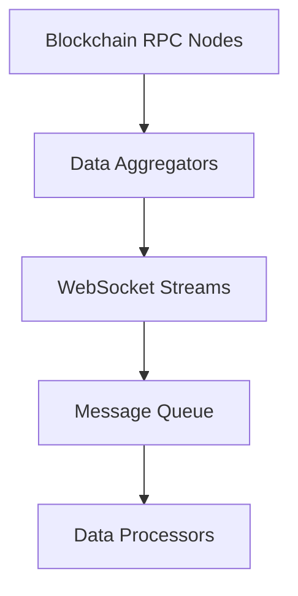

# Data Flow Architecture

## Overview

The ARX Wallet Tracker implements a sophisticated data flow architecture that handles real-time cryptocurrency data processing through multiple interconnected layers.

## Core Data Flow Components

### 1. Data Ingestion Layer



#### Primary Data Sources
- **Helius API**: Solana transaction data and account information
- **Birdeye API**: Price feeds, market data, and token metadata
- **WebSocket Connections**: Real-time blockchain event streaming
- **Direct RPC**: Fallback for critical data integrity

### 2. Stream Processing Architecture

The system implements a multi-stage stream processing pipeline:

#### Stage 1: Raw Data Capture
- Captures raw blockchain events
- Applies initial validation filters
- Maintains data lineage tracking
- Implements circuit breaker patterns for API failures

#### Stage 2: Signal Processing
```typescript
interface SignalProcessingPipeline {
  rawEvents: BlockchainEvent[];
  filters: EventFilter[];
  transformers: DataTransformer[];
  enrichers: DataEnricher[];
  validators: DataValidator[];
}
```

#### Stage 3: AI Signal Generation
- Machine learning models for pattern recognition
- Risk assessment algorithms
- Predictive analytics for wallet behavior
- Anomaly detection systems

### 3. Caching Strategy

#### Multi-Level Cache Architecture
```
L1 Cache (Memory) -> L2 Cache (Redis) -> L3 Cache (Database)
     100ms               1s                10s
```

#### Cache Invalidation Patterns
- **Time-based**: Automatic expiration for price data (30s)
- **Event-based**: Transaction confirmations trigger cache updates
- **Manual**: Admin override for emergency cache clearing
- **Predictive**: Pre-loading based on user behavior patterns

### 4. Data Consistency Model

#### Eventual Consistency
- Prioritizes availability over immediate consistency
- Implements conflict resolution for concurrent updates
- Maintains audit trails for all state changes

#### ACID Properties
- **Atomicity**: Transaction batching ensures all-or-nothing operations
- **Consistency**: Schema validation at ingestion points
- **Isolation**: Read replicas prevent query interference
- **Durability**: Multi-region backup and replication

## Performance Metrics

### Latency Requirements
- **WebSocket Messages**: < 50ms processing time
- **API Responses**: < 200ms response time
- **AI Signal Generation**: < 500ms from trigger to delivery
- **Cache Hit Ratio**: > 95% for frequently accessed data

### Throughput Specifications
- **Transaction Processing**: 10,000 TPS sustained
- **Concurrent Users**: 50,000 active connections
- **Data Ingestion**: 1M events/minute peak load
- **Storage Growth**: 100GB/day estimated

## Error Handling and Recovery

### Circuit Breaker Implementation
```typescript
interface CircuitBreakerConfig {
  failureThreshold: number; // 5 failures
  recoveryTimeout: number;  // 30s
  halfOpenRetryCount: number; // 3 attempts
  monitoringWindow: number; // 60s
}
```

### Fallback Strategies
1. **Primary API Failure**: Automatic failover to secondary endpoints
2. **Database Unavailability**: Graceful degradation to cache-only mode
3. **AI Service Outage**: Basic rule-based signal generation
4. **Network Partitions**: Local processing with eventual sync

## Security Considerations

### Data Protection
- End-to-end encryption for sensitive wallet data
- Zero-knowledge architecture for private key handling
- API key rotation and secure storage
- Rate limiting and DDoS protection

### Access Control
- Role-based permissions for different user tiers
- API authentication using JWT tokens
- Audit logging for all data access patterns
- Compliance with financial data regulations

## Monitoring and Observability

### Key Performance Indicators
- Data freshness metrics
- API response times
- Error rates by service
- User engagement analytics
- Resource utilization trends

### Alerting Thresholds
- CPU usage > 80%
- Memory usage > 85%
- Error rate > 1%
- Response time > 500ms
- Queue depth > 1000 messages
