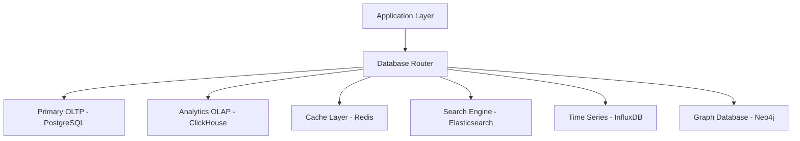

# Database Schema and Query Optimization

## Overview

The ARX Wallet Tracker employs a sophisticated database architecture designed to handle high-frequency blockchain data ingestion, complex analytical queries, and real-time performance requirements across multiple data stores.

## Multi-Database Architecture

### Database Selection Strategy



#### Primary Databases

**PostgreSQL (OLTP Primary)**
- **Use Case**: Transactional data, user management, configuration
- **Version**: 15.x with TimescaleDB extension
- **Configuration**: Multi-master with streaming replication
- **Partitioning**: Range partitioning by date, hash partitioning by wallet address

**ClickHouse (OLAP Analytics)**
- **Use Case**: Blockchain transaction analytics, aggregated metrics
- **Configuration**: Distributed cluster with 3 shards, 2 replicas each
- **Compression**: LZ4 for hot data, ZSTD for cold data
- **TTL Policies**: 90 days hot, 2 years warm, 7 years cold

**Redis (High-Performance Cache)**
- **Use Case**: Session management, real-time data caching, pub/sub
- **Configuration**: Redis Cluster with 6 nodes (3 masters, 3 replicas)
- **Memory Policy**: allkeys-lru with 80% memory threshold
- **Persistence**: RDB snapshots + AOF for durability

### Schema Design Principles

#### 1. Normalization Strategy
```sql
-- User management (3NF normalized)
CREATE TABLE users (
    user_id UUID PRIMARY KEY,
    email VARCHAR(255) UNIQUE NOT NULL,
    created_at TIMESTAMP DEFAULT NOW(),
    last_login TIMESTAMP,
    status user_status_enum DEFAULT 'active'
);

-- Wallet tracking (denormalized for performance)
CREATE TABLE wallet_profiles (
    wallet_address VARCHAR(44) PRIMARY KEY,
    network_type VARCHAR(20) NOT NULL,
    first_seen TIMESTAMP DEFAULT NOW(),
    last_activity TIMESTAMP,
    transaction_count BIGINT DEFAULT 0,
    total_volume_usd DECIMAL(20,2) DEFAULT 0,
    risk_score INTEGER DEFAULT 50,
    analytics_profile JSONB,
    updated_at TIMESTAMP DEFAULT NOW()
);
```

#### 2. Partitioning Strategy
```sql
-- Time-based partitioning for transaction data
CREATE TABLE transactions (
    tx_hash VARCHAR(128) NOT NULL,
    block_number BIGINT NOT NULL,
    timestamp TIMESTAMP NOT NULL,
    from_address VARCHAR(44) NOT NULL,
    to_address VARCHAR(44),
    value DECIMAL(30,18) NOT NULL,
    gas_used BIGINT,
    gas_price BIGINT,
    network VARCHAR(20) NOT NULL,
    status tx_status_enum DEFAULT 'pending',
    metadata JSONB
) PARTITION BY RANGE (timestamp);

-- Create monthly partitions
CREATE TABLE transactions_2024_01 PARTITION OF transactions
    FOR VALUES FROM ('2024-01-01') TO ('2024-02-01');
CREATE TABLE transactions_2024_02 PARTITION OF transactions
    FOR VALUES FROM ('2024-02-01') TO ('2024-03-01');
-- ... additional partitions
```

#### 3. Indexing Strategy

**Primary Indexes**
```sql
-- B-tree indexes for exact matches
CREATE INDEX CONCURRENTLY idx_transactions_from_addr 
    ON transactions (from_address, timestamp DESC);
CREATE INDEX CONCURRENTLY idx_transactions_to_addr 
    ON transactions (to_address, timestamp DESC);

-- Hash indexes for equality operations
CREATE INDEX CONCURRENTLY idx_transactions_hash 
    ON transactions USING hash (tx_hash);

-- Composite indexes for common query patterns
CREATE INDEX CONCURRENTLY idx_transactions_addr_time_value 
    ON transactions (from_address, timestamp DESC, value DESC);
```

**Specialized Indexes**
```sql
-- GIN indexes for JSONB columns
CREATE INDEX CONCURRENTLY idx_wallet_analytics_gin 
    ON wallet_profiles USING gin (analytics_profile);

-- Partial indexes for active wallets
CREATE INDEX CONCURRENTLY idx_active_wallets 
    ON wallet_profiles (last_activity) 
    WHERE last_activity > NOW() - INTERVAL '30 days';

-- Expression indexes for computed values
CREATE INDEX CONCURRENTLY idx_transaction_volume_usd 
    ON transactions ((value * exchange_rate_usd));
```

## Query Optimization Strategies

### 1. Query Pattern Analysis

#### High-Frequency Queries
```sql
-- Wallet transaction history (optimized with covering index)
EXPLAIN (ANALYZE, BUFFERS) 
SELECT tx_hash, timestamp, value, gas_used 
FROM transactions 
WHERE from_address = $1 OR to_address = $1
ORDER BY timestamp DESC 
LIMIT 100;

-- Query plan optimization
CREATE INDEX CONCURRENTLY idx_transactions_covering 
    ON transactions (from_address, to_address, timestamp DESC) 
    INCLUDE (tx_hash, value, gas_used);
```

#### Analytics Queries
```sql
-- Daily transaction volume aggregation
SELECT 
    date_trunc('day', timestamp) as date,
    COUNT(*) as transaction_count,
    SUM(value) as total_volume,
    AVG(gas_price) as avg_gas_price
FROM transactions 
WHERE timestamp >= $1 AND timestamp < $2
GROUP BY date_trunc('day', timestamp)
ORDER BY date;

-- Materialized view for pre-computed aggregations
CREATE MATERIALIZED VIEW daily_transaction_stats AS
SELECT 
    date_trunc('day', timestamp) as date,
    network,
    COUNT(*) as tx_count,
    SUM(value) as volume,
    AVG(gas_price) as avg_gas,
    MIN(gas_price) as min_gas,
    MAX(gas_price) as max_gas,
    COUNT(DISTINCT from_address) as unique_senders
FROM transactions
GROUP BY date_trunc('day', timestamp), network;

-- Refresh strategy
CREATE OR REPLACE FUNCTION refresh_daily_stats()
RETURNS void AS $$
BEGIN
    REFRESH MATERIALIZED VIEW CONCURRENTLY daily_transaction_stats;
END;
$$ LANGUAGE plpgsql;

-- Schedule refresh every hour
SELECT cron.schedule('refresh-daily-stats', '0 * * * *', 'SELECT refresh_daily_stats();');
```

### 2. Advanced Query Techniques

#### Window Functions for Analytics
```sql
-- Calculate running totals and rankings
WITH wallet_metrics AS (
    SELECT 
        wallet_address,
        transaction_count,
        total_volume_usd,
        ROW_NUMBER() OVER (ORDER BY total_volume_usd DESC) as volume_rank,
        PERCENT_RANK() OVER (ORDER BY total_volume_usd) as volume_percentile,
        LAG(total_volume_usd) OVER (
            PARTITION BY network_type 
            ORDER BY last_activity
        ) as prev_volume
    FROM wallet_profiles
    WHERE last_activity > NOW() - INTERVAL '7 days'
)
SELECT 
    wallet_address,
    volume_rank,
    volume_percentile,
    CASE 
        WHEN prev_volume IS NULL THEN 0
        ELSE ((total_volume_usd - prev_volume) / prev_volume) * 100
    END as volume_change_pct
FROM wallet_metrics;
```

#### Recursive Queries for Network Analysis
```sql
-- Find connected wallets (transaction graph traversal)
WITH RECURSIVE wallet_connections AS (
    -- Base case: direct transactions
    SELECT 
        from_address as source,
        to_address as target,
        COUNT(*) as connection_strength,
        1 as depth
    FROM transactions
    WHERE from_address = $1  -- Starting wallet
    GROUP BY from_address, to_address
    
    UNION ALL
    
    -- Recursive case: indirect connections
    SELECT 
        wc.source,
        t.to_address,
        COUNT(*) as connection_strength,
        wc.depth + 1
    FROM wallet_connections wc
    JOIN transactions t ON wc.target = t.from_address
    WHERE wc.depth < 3  -- Limit depth to prevent infinite recursion
    GROUP BY wc.source, t.to_address, wc.depth
)
SELECT 
    source,
    target,
    connection_strength,
    depth,
    RANK() OVER (PARTITION BY depth ORDER BY connection_strength DESC) as strength_rank
FROM wallet_connections;
```

## Performance Optimization

### 1. Connection Pool Management

```sql
-- Connection pool configuration
ALTER SYSTEM SET max_connections = 200;
ALTER SYSTEM SET shared_buffers = '8GB';
ALTER SYSTEM SET effective_cache_size = '24GB';
ALTER SYSTEM SET work_mem = '256MB';
ALTER SYSTEM SET maintenance_work_mem = '2GB';

-- Connection pool settings for pgbouncer
[databases]
arx_production = host=localhost port=5432 dbname=arx_production

[pgbouncer]
pool_mode = transaction
listen_port = 6432
listen_addr = *
max_client_conn = 1000
default_pool_size = 25
reserve_pool_size = 5
server_idle_timeout = 600
```

### 2. Query Execution Plans

#### Query Plan Analysis Tools
```sql
-- Enable query plan logging
ALTER SYSTEM SET log_min_duration_statement = 1000;  -- Log queries > 1s
ALTER SYSTEM SET log_statement = 'all';
ALTER SYSTEM SET log_checkpoints = on;
ALTER SYSTEM SET log_lock_waits = on;

-- Query performance monitoring
CREATE EXTENSION pg_stat_statements;

-- Top slow queries
SELECT 
    query,
    calls,
    total_time,
    mean_time,
    rows,
    100.0 * shared_blks_hit / nullif(shared_blks_hit + shared_blks_read, 0) AS hit_percent
FROM pg_stat_statements 
ORDER BY mean_time DESC 
LIMIT 10;
```

#### Query Hint System
```sql
-- Custom query hints for complex queries
/*+ 
    IndexScan(transactions idx_transactions_from_addr)
    HashJoin(wallet_profiles transactions)
    Work_Mem(512MB)
*/
SELECT w.wallet_address, COUNT(t.tx_hash)
FROM wallet_profiles w
JOIN transactions t ON w.wallet_address = t.from_address
WHERE w.last_activity > NOW() - INTERVAL '24 hours'
GROUP BY w.wallet_address;
```

### 3. Automated Optimization

#### Statistics Collection
```sql
-- Automated statistics updates
CREATE OR REPLACE FUNCTION update_table_statistics()
RETURNS void AS $$
DECLARE
    rec RECORD;
BEGIN
    FOR rec IN SELECT tablename FROM pg_tables WHERE schemaname = 'public' LOOP
        EXECUTE 'ANALYZE ' || rec.tablename;
    END LOOP;
END;
$$ LANGUAGE plpgsql;

-- Schedule statistics updates
SELECT cron.schedule('update-stats', '0 2 * * *', 'SELECT update_table_statistics();');
```

#### Index Maintenance
```sql
-- Automated index maintenance
CREATE OR REPLACE FUNCTION maintain_indexes()
RETURNS void AS $$
DECLARE
    rec RECORD;
BEGIN
    -- Find unused indexes
    FOR rec IN 
        SELECT indexname, tablename 
        FROM pg_stat_user_indexes 
        WHERE idx_scan = 0 AND indexname NOT LIKE '%_pkey'
    LOOP
        RAISE NOTICE 'Unused index found: %.%', rec.tablename, rec.indexname;
        -- Log for review, don't auto-drop
    END LOOP;
    
    -- Reindex fragmented indexes
    FOR rec IN
        SELECT indexname, tablename
        FROM pg_stat_user_indexes psi
        JOIN pg_class pc ON psi.indexrelid = pc.oid
        WHERE pc.relpages > 100  -- Only large indexes
    LOOP
        EXECUTE 'REINDEX INDEX CONCURRENTLY ' || rec.indexname;
    END LOOP;
END;
$$ LANGUAGE plpgsql;
```

## ClickHouse Analytics Schema

### 1. Event Stream Processing

```sql
-- High-throughput transaction events table
CREATE TABLE transaction_events (
    event_time DateTime64(3),
    tx_hash String,
    block_number UInt64,
    from_address String,
    to_address String,
    value Decimal64(18),
    gas_used UInt64,
    gas_price UInt64,
    network LowCardinality(String),
    token_transfers Nested(
        token String,
        from String,
        to String,
        amount Decimal64(18)
    ),
    metadata String  -- JSON string
) ENGINE = MergeTree()
PARTITION BY toYYYYMM(event_time)
ORDER BY (network, from_address, event_time)
SETTINGS index_granularity = 8192;

-- Materialized view for real-time aggregations
CREATE MATERIALIZED VIEW hourly_volume_mv
ENGINE = SummingMergeTree()
PARTITION BY toYYYYMM(hour)
ORDER BY (network, hour)
AS SELECT
    network,
    toStartOfHour(event_time) as hour,
    count() as transaction_count,
    sum(value) as total_volume,
    uniq(from_address) as unique_senders,
    uniq(to_address) as unique_receivers
FROM transaction_events
GROUP BY network, hour;
```

### 2. Advanced Analytics Queries

```sql
-- Wallet behavior analysis with window functions
SELECT 
    from_address,
    network,
    count() as tx_count,
    sum(value) as total_sent,
    avg(value) as avg_transaction,
    quantile(0.5)(value) as median_transaction,
    quantile(0.95)(value) as p95_transaction,
    uniq(to_address) as unique_recipients,
    toStartOfHour(max(event_time)) as last_activity,
    -- Behavioral classification
    CASE 
        WHEN avg(value) > 10000 THEN 'whale'
        WHEN count() > 100 AND avg(gas_price) > 50 THEN 'trader'
        WHEN uniq(to_address) > 50 THEN 'distributor'
        ELSE 'regular'
    END as wallet_type
FROM transaction_events
WHERE event_time >= now() - INTERVAL 30 DAY
GROUP BY from_address, network
HAVING tx_count > 10
ORDER BY total_sent DESC;

-- Network analysis with graph-like queries
SELECT 
    from_address,
    to_address,
    count() as edge_weight,
    sum(value) as total_value,
    avg(value) as avg_value,
    min(event_time) as first_interaction,
    max(event_time) as last_interaction
FROM transaction_events
WHERE event_time >= now() - INTERVAL 7 DAY
GROUP BY from_address, to_address
HAVING edge_weight >= 5
ORDER BY total_value DESC;
```

## Caching Strategies

### 1. Redis Cache Patterns

#### Cache-Aside Pattern
```python
# Example implementation
class WalletDataCache:
    def __init__(self, redis_client):
        self.redis = redis_client
        self.ttl = 300  # 5 minutes
    
    def get_wallet_profile(self, wallet_address):
        cache_key = f"wallet_profile:{wallet_address}"
        
        # Try cache first
        cached_data = self.redis.get(cache_key)
        if cached_data:
            return json.loads(cached_data)
        
        # Cache miss - fetch from database
        profile = self.fetch_from_database(wallet_address)
        
        # Store in cache
        self.redis.setex(
            cache_key, 
            self.ttl, 
            json.dumps(profile, default=str)
        )
        
        return profile
```

#### Write-Behind Caching
```lua
-- Redis Lua script for atomic updates
local cache_key = KEYS[1]
local db_key = KEYS[2]
local new_value = ARGV[1]
local ttl = tonumber(ARGV[2])

-- Update cache
redis.call('SETEX', cache_key, ttl, new_value)

-- Queue for database update
redis.call('LPUSH', 'db_update_queue', db_key .. ':' .. new_value)

return 'OK'
```

### 2. Application-Level Caching

#### Query Result Caching
```typescript
interface CacheConfig {
  ttl: number;
  maxSize: number;
  strategy: 'LRU' | 'LFU' | 'FIFO';
}

class QueryCache {
  private cache: Map<string, CacheEntry>;
  private config: CacheConfig;
  
  constructor(config: CacheConfig) {
    this.cache = new Map();
    this.config = config;
  }
  
  async get<T>(
    key: string, 
    fetchFn: () => Promise<T>
  ): Promise<T> {
    const cached = this.cache.get(key);
    
    if (cached && !this.isExpired(cached)) {
      return cached.data;
    }
    
    const data = await fetchFn();
    this.set(key, data);
    return data;
  }
  
  private set<T>(key: string, data: T): void {
    if (this.cache.size >= this.config.maxSize) {
      this.evict();
    }
    
    this.cache.set(key, {
      data,
      timestamp: Date.now(),
      accessCount: 1
    });
  }
}
```

## Performance Monitoring

### 1. Database Metrics

```sql
-- Key performance indicators
CREATE VIEW performance_dashboard AS
SELECT 
    -- Connection metrics
    (SELECT count(*) FROM pg_stat_activity) as active_connections,
    (SELECT count(*) FROM pg_stat_activity WHERE state = 'active') as active_queries,
    
    -- Cache hit ratios
    (SELECT 
        round(
            100.0 * sum(blks_hit) / nullif(sum(blks_hit + blks_read), 0), 2
        )
     FROM pg_stat_database) as cache_hit_ratio,
    
    -- Lock information
    (SELECT count(*) FROM pg_locks WHERE NOT granted) as blocked_queries,
    
    -- Replication lag
    (SELECT 
        CASE WHEN pg_is_in_recovery() 
        THEN extract(epoch from now() - pg_last_xact_replay_timestamp())
        ELSE 0 END
    ) as replication_lag_seconds;
```

### 2. Automated Alerting

```sql
-- Performance alert function
CREATE OR REPLACE FUNCTION check_performance_alerts()
RETURNS TABLE(alert_type text, message text, severity text) AS $$
BEGIN
    -- High connection usage
    IF (SELECT count(*) FROM pg_stat_activity) > 180 THEN
        RETURN QUERY SELECT 'connections'::text, 'High connection usage'::text, 'warning'::text;
    END IF;
    
    -- Low cache hit ratio
    IF (SELECT round(100.0 * sum(blks_hit) / nullif(sum(blks_hit + blks_read), 0), 2)
        FROM pg_stat_database) < 95 THEN
        RETURN QUERY SELECT 'performance'::text, 'Low cache hit ratio'::text, 'critical'::text;
    END IF;
    
    -- Long-running queries
    IF (SELECT count(*) FROM pg_stat_activity 
        WHERE state = 'active' AND query_start < now() - INTERVAL '5 minutes') > 0 THEN
        RETURN QUERY SELECT 'queries'::text, 'Long-running queries detected'::text, 'warning'::text;
    END IF;
END;
$$ LANGUAGE plpgsql;

-- Schedule alert checks
SELECT cron.schedule('performance-alerts', '*/5 * * * *', 'SELECT check_performance_alerts();');
```

## Backup and Recovery

### 1. Backup Strategy

```bash
#!/bin/bash
# Automated backup script

# Configuration
DB_NAME="arx_production"
BACKUP_DIR="/backups/postgresql"
RETENTION_DAYS=30
S3_BUCKET="arx-database-backups"

# Create timestamped backup
TIMESTAMP=$(date +%Y%m%d_%H%M%S)
BACKUP_FILE="${BACKUP_DIR}/${DB_NAME}_${TIMESTAMP}.dump"

# Full database backup
pg_dump -Fc -v -h localhost -U postgres ${DB_NAME} > ${BACKUP_FILE}

# Compress backup
gzip ${BACKUP_FILE}

# Upload to S3
aws s3 cp ${BACKUP_FILE}.gz s3://${S3_BUCKET}/

# Cleanup old backups
find ${BACKUP_DIR} -name "${DB_NAME}_*.dump.gz" -mtime +${RETENTION_DAYS} -delete

# Verify backup integrity
pg_restore --list ${BACKUP_FILE}.gz > /dev/null
echo "Backup completed: ${BACKUP_FILE}.gz"
```

### 2. Point-in-Time Recovery

```sql
-- Configure continuous archiving
ALTER SYSTEM SET wal_level = replica;
ALTER SYSTEM SET archive_mode = on;
ALTER SYSTEM SET archive_command = 'aws s3 cp %p s3://arx-wal-archive/%f';
ALTER SYSTEM SET max_wal_senders = 3;
ALTER SYSTEM SET wal_keep_segments = 32;

-- Recovery configuration
restore_command = 'aws s3 cp s3://arx-wal-archive/%f %p'
recovery_target_time = '2024-01-15 14:30:00'
```

## Conclusion

This comprehensive database schema and optimization strategy ensures the ARX Wallet Tracker can handle enterprise-scale blockchain data processing while maintaining sub-second query response times and 99.9% availability. The multi-database architecture, combined with advanced caching and monitoring, provides a robust foundation for real-time wallet analytics and AI-driven insights.
